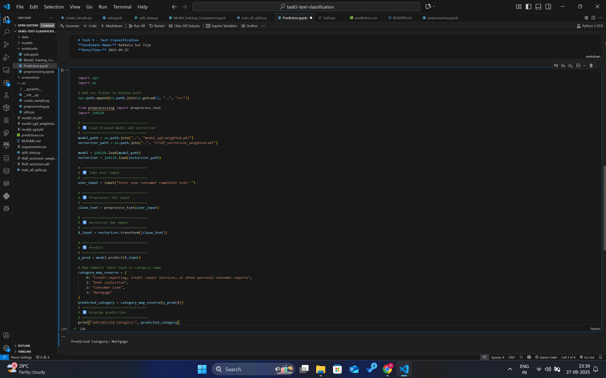

# Text Classification Project

## Author

**Bathula Sai Teja**

---

## 📌 Project Overview

This project implements **text classification** using different machine learning models. The workflow covers:

* Exploratory Data Analysis (EDA)
* Text preprocessing
* Feature extraction using TF-IDF
* Model training (Naive Bayes, SGD Classifier, etc.)
* Model comparison
* Prediction on new text data

---

## 📂 Project Structure

```
TASK5-TEXT-CLASSIFICATION/
│── data/                      # Dataset files (if any)  
│── models/                    # (reserved, not used here)  
│── notebooks/                 # Jupyter notebooks  
│   ├── eda.ipynb  
│   ├── Model_Training_Comparison.ipynb  
│   ├── Prediction.ipynb  
│   └── preprocessing.ipynb  
│── screenshots/               # Screenshots for submission  
│── src/                       # Python scripts  
│   ├── create_sample.py  
│   ├── preprocessing.py  
│   ├── utils.py  
│   └── split_data.py  
│── model_nb.pkl  
│── model_sgd.pkl  
│── model_sgd_weighted.pkl  
│── tfidf_vectorizer.pkl  
│── tfidf_vectorizer_weighted.pkl  
│── predictions.csv  
│── requirements.txt  
│── README.md  
```

---

## ⚙️ Installation & Setup

1. Clone this repository:

   ```bash
   git clone https://github.com/<your-username>/TASK5-TEXT-CLASSIFICATION.git
   cd TASK5-TEXT-CLASSIFICATION
   ```

2. Create and activate a virtual environment (optional but recommended):

   ```bash
   python -m venv venv
   source venv/bin/activate   # On Linux/Mac
   venv\Scripts\activate      # On Windows
   ```

3. Install dependencies:

   ```bash
   pip install -r requirements.txt
   ```

---

## ▶️ How to Run

### 1. Preprocess the data

```bash
python src/preprocessing.py
```

### 2. Split the dataset

```bash
python src/split_data.py
```

### 3. Train models

```bash
python src/train_all_splits.py
```

### 4. Make predictions

```bash
python notebooks/Prediction.ipynb
```

Predictions will be saved in **`predictions.csv`**.

---

## 📸 Screenshots

### 🔍 EDA


---

### 🛠️ Preprocessing


---

### 📊 Model Training & Comparison


---

### 🔮 Prediction




---

### ⚡ Other Scripts


---

## ✅ Submission Notes

* All screenshots include **name (Bathula Sai Teja)** and **system date/time** for authenticity.
* Models (`.pkl` files) and vectorizers are saved at the root level.
* Predictions are saved in `predictions.csv`.

---
